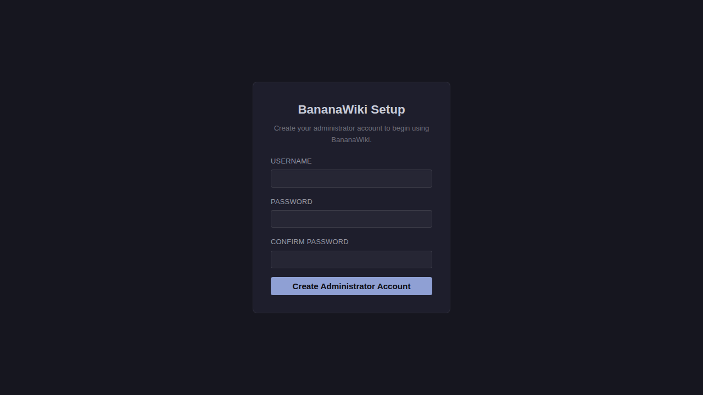
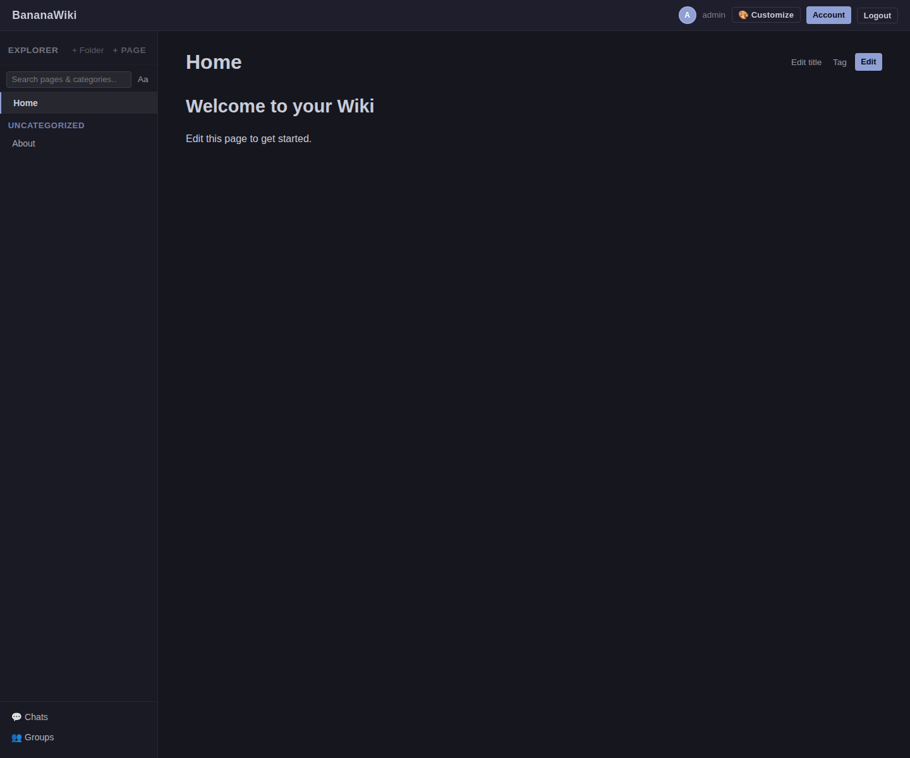
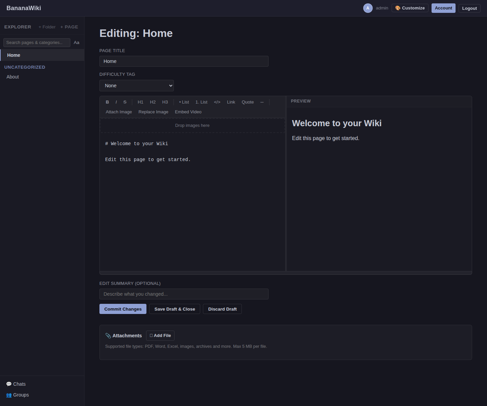
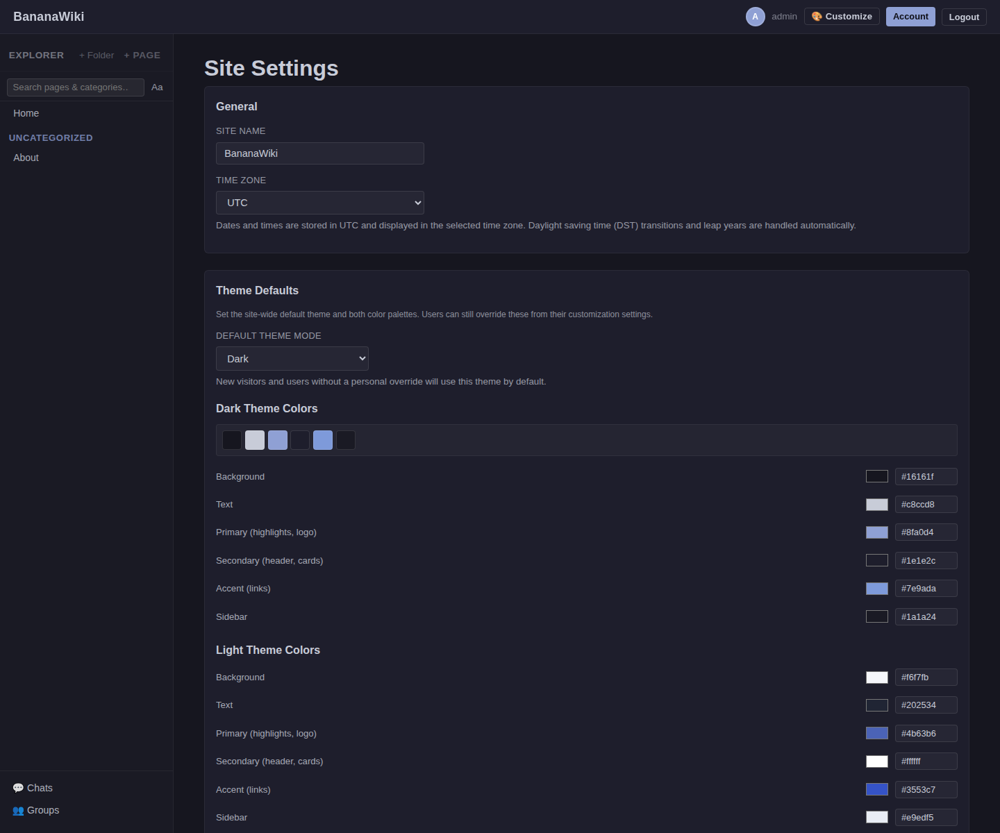
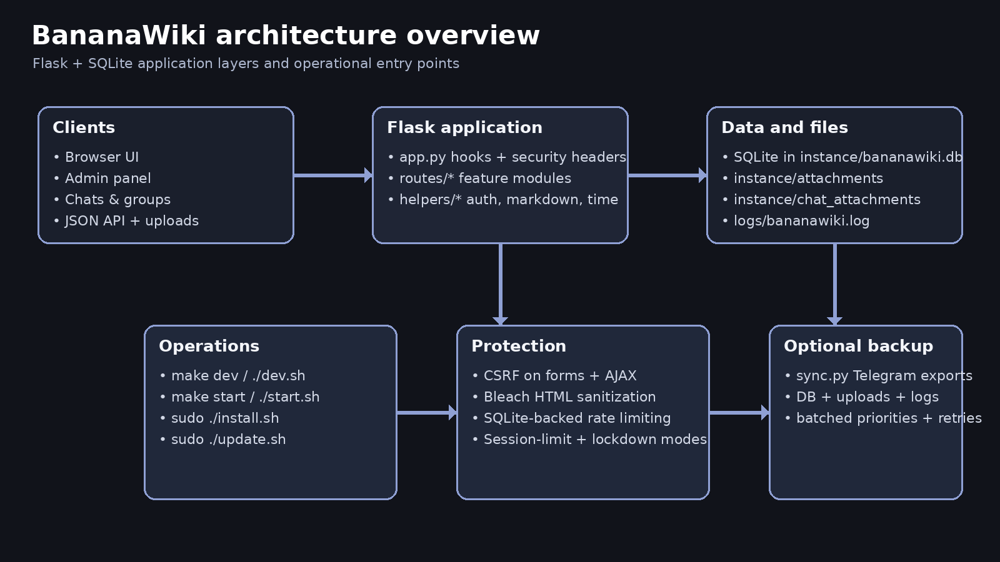

# BananaWiki

BananaWiki is a self-hosted knowledge base built with Flask and SQLite. It is designed for private teams that want a wiki with strong editing tools, granular permissions, built-in collaboration features, and simple operations: one Python app, one SQLite database, no external services required.


## What BananaWiki includes

- Markdown pages with live preview, image insertion, attachment uploads, video embedding, and page history
- Hierarchical categories with drag-to-reorder navigation and optional sequential reading mode
- Draft autosave, concurrent-edit awareness, page reservations, and attribution tracking
- Profiles, direct messages, group chats, announcements, badges, and user data export
- Four-tier roles plus fine-grained permissions and category-level access controls
- Production helpers for local development, Gunicorn startup, installation, updates, and backups

## Screenshots

| Setup | Wiki home |
| --- | --- |
|  |  |

| Editor | Admin settings |
| --- | --- |
|  |  |

## Architecture at a glance



BananaWiki keeps its moving parts intentionally small:

- **Flask app:** routes live in `routes/`, helpers in `helpers/`, startup/security hooks in `app.py`
- **Database layer:** all SQL is isolated under `db/`
- **UI:** Jinja templates plus one CSS file and one JavaScript file, with no frontend build step
- **Runtime data:** SQLite database, attachments, chat files, and logs live under `instance/` and `logs/`

For deeper reference, see:

- [`docs/getting-started.md`](docs/getting-started.md)
- [`docs/feature-reference.md`](docs/feature-reference.md)
- [`docs/operations.md`](docs/operations.md)
- [`docs/architecture-and-security.md`](docs/architecture-and-security.md)

## Quick start

### Requirements

- Python **3.9+**
- A POSIX-like shell for the helper scripts (`dev.sh`, `start.sh`, `install.sh`, `update.sh`)
- For production automation: Debian/Ubuntu with `sudo`, optional nginx, optional Let's Encrypt

### Local development or evaluation

```bash
git clone https://github.com/OVTDAcc/BananaWiki.git
cd BananaWiki
make dev
```

`make dev` creates `./venv`, installs `requirements.txt`, and starts the Flask development server at `http://127.0.0.1:5001`.

Alternative commands:

```bash
./dev.sh
./dev.sh --host 0.0.0.0 --port 5001
```

### Run the test suite

```bash
make test
```

Manual equivalent after activating the virtualenv:

```bash
. venv/bin/activate
python -m pytest tests/ -v
```

### Production start without installation automation

```bash
python3 -m venv venv
. venv/bin/activate
pip install -r requirements.txt
./start.sh
```

You can also run Gunicorn directly:

```bash
gunicorn wsgi:app -c gunicorn.conf.py
```

### Fully automated production install

```bash
sudo ./install.sh
```

Common non-interactive form:

```bash
sudo ./install.sh --non-interactive --domain wiki.example.com --email admin@example.com --ssl
```

## First-run flow

1. Start the app.
2. Visit the site in a browser.
3. BananaWiki redirects to `/setup` until `setup_done` is recorded.
4. Create the first administrator account.
5. Sign in and begin configuring the wiki from **Admin → Site Settings**.

New users are normally added by invite code or from the admin panel.

## Core features

### Writing and content management

- Markdown editor with live preview, formatting toolbar, image upload modal, and internal-link picker
- Page attachments served through authenticated routes instead of public static URLs
- Full page history with edit summaries, snapshot viewing, and revert
- Difficulty tags, URL slug rename, and deindexing for pages that should stay accessible but hidden from navigation/search
- Sequential navigation for categories that should read like chapters

### Collaboration and community

- Browser draft autosave and conflict detection
- User profiles with avatars, bios, and contribution heatmaps
- Direct messages and moderated group chats with attachment support
- Badge system with notifications and auto-award triggers
- Site-wide announcements and people sidebar widgets

### Admin and governance

- Roles: `user`, `editor`, `admin`, `protected_admin`
- Fine-grained permissions and category-specific access restrictions
- Lockdown mode, one-session-per-user enforcement, invite code management, and audit history
- Full-site export/import plus optional Telegram backup sync

## Configuration summary

Most static instance configuration lives in [`config.py`](config.py), including:

- bind host/port and proxy mode
- database and filesystem paths
- upload/attachment limits
- page history and reservation durations
- Telegram sync settings
- logging path and verbosity

Many day-to-day runtime controls are managed in the database from **Admin → Site Settings**, including:

- theme defaults and light/dark palettes
- favicon selection or custom upload
- lockdown mode message
- session limit toggle
- chat enablement, quotas, and cleanup schedule
- page reservation enablement and reservation/cooldown timing

## Repository layout

```text
BananaWiki/
├── app.py                 Flask application entry point
├── config.py              Static configuration values
├── db/                    Database access layer and migrations
├── helpers/               Authentication, markdown, validation, time, permissions
├── routes/                Feature route modules
├── app/templates/         Jinja templates
├── app/static/            CSS, JavaScript, favicons, runtime uploads (gitignored)
├── docs/                  Rewritten user and operator documentation
├── tests/                 Pytest suite
├── dev.sh                 Local development launcher
├── start.sh               Gunicorn startup wrapper
├── install.sh             Automated production installer
├── update.sh              Backup-aware updater
├── setup.py               Server provisioning wizard
└── reset_password.py      CLI password reset tool
```

## Troubleshooting

### The app keeps redirecting to `/setup`
The wiki has not finished first-run provisioning yet. Create the initial admin account in the browser.

### Login sessions do not persist behind a reverse proxy
Check `PROXY_MODE` in `config.py`. When enabled, BananaWiki trusts forwarded headers and marks cookies secure.

### Chat quotas or cleanup timing do not match `config.py`
Those settings are managed from **Admin → Site Settings** in the current codebase, not as constants in `config.py`.

### I need a production-safe update path
Use `sudo ./update.sh`. It creates backups, pulls changes, refreshes dependencies, restarts the service, and verifies the deployment.

## Contributing

1. Create or activate the local virtual environment.
2. Run `make test` before and after your change.
3. Keep SQL in `db/`, route handlers in `routes/`, and pure helpers in `helpers/`.
4. Preserve the security model: CSRF on mutations, sanitized Markdown output, parameterized SQL, and authenticated attachment downloads.
